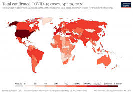

######Tutorial for Data Science

###Table of Contents

I. Introduction

II. Data
  i. Data Preparation
  ii. Data Manipulation
  
III. Analysis
  i. Statistical
  ii. Visual
  
IV. Regression

V. Conclusion

##I. Introduction

  Hello! Welcome to the Data Science Tutorial! We will teach you how to work with R and how to work with data sets! The data set we are working with is coronavirus cases around the world, as this is the most current problem we have to face. As a result, understanding the data gathered from cases around the globe can slow down and possibly prevent the spread of this virus. 

  We will show you how to turn a data set(which can be represented by an Excel Spreadsheet) into a spreadsheet with only the data we want, how to add to the data, how to create graphs, and how to make inferences and future predictions based off the graphs. These predictions could help solve this COVID-19 crisis as we could figure out through predictions from models where the problem is most persistent, where it will be the most persistent in the future, and who is most likely to get it.

## 1. Data Preparation

This segment of code initializes the data and allows us to work with data sets. This image below is what the current state of retrovirus is at. This can all be created through the use of data. 
```{r setup, include=TRUE}
knitr::opts_chunk$set(echo = TRUE)

```

  As a start, we have to load packages into R Studio, which allows us to access and use many of R Studio's functionalities. This also allows us to exclude unnecessary packages which could cause conflicting attributes and data representations. For example, the tidyverse package allows us to create graphs/charts based on the provided data set and modify them as well. Tidyverse is a package which contains many other packages for the most commonly used functionalities in R Studio.
```{r}
library(tidyverse)
library(askpass)
library(datasets)
library(lubridate)
library(stringr)
library(leaflet)
```

  This chunk of code below is setting our data frame to the data set contained in the file name called: "COVID19_line_list_data.csv". If you wanted to work with this data set, you would have to download the .csv file and save it in a folder along with this R Markdown file. This would allow the data set to be manipulated, given the name "data". 
```{r}
data <- read_csv("data/final_covid_data.csv")
data
```

  This variable called "simple_data" is our original data set with one modification. There are a large number of columns, many of which have empty values or are irrelevant in gathering useful data, so we want to keep all the relevant columns. In this case, we are saving the rows for dates reported for coronavirus, the country that reported the case, the gender of the person with the virus, their age, and the geographical coorinates of their location when the virus was discovered in them. This cleans up our data set as we have only what we need. 
```{r}
simple_data <- data %>%
  select("date_confirmation", "country", "sex", "age", "latitude", "longitude")
simple_data
```

  This next chunk is working with making it much easier to work with our reporting date column. There is no real numerical order as to sorting by date as we have to consider the year, the month, and the day. At the same time the format for a date can be day-month-year, month-day-year, year-month-day. Also, the "-" could be a "/". To account for this complication, we use the lubridate package which formats our date into the proper format so we can do operations on the various dates. We add this new column and set its title to "date". We can then discard the original reporting date_confirmation as we have a newly formatted, usable date column.
  
```{r}
simple_data <- simple_data %>%
  mutate(date=dmy(simple_data$`date_confirmation`), age=as.integer(age))%>%
  mutate(sex=na_if(sex , "N/A")) %>%
  select(-"date_confirmation")
simple_data
```

##2. Data Manipulation

  Next, we need to fix what we are given in the tables. Some rows have empty attributes in such cases where the age or gender of a person is not given (represented by "NA"). In this case, we will take the average of the age in a country, and fill in that age for NA. We will apply the same principle for the gender to make the data more accurate. The mutate statement converts the type of a column to a number. The value passed in is a word, so we need to make the column type into a number to perform operations on said column. By converting age, latitude, and longitude into numbers, we can take the average of them to gather an accurate age and location of where the person was when they were found positive with COVID-19.
  
  What we also do is remove the columns whose null attributes give us no context we can make inferences on. In this case: Gender and Country. There is no quantitive data one can make based on those categorical values, so randomly assigning them would give incorrect data. Therefore, we must remove those rows as they cannoy give us real data to work with.

```{r}
new_simple_data <- simple_data %>%  mutate(age = as.numeric(age))  %>%
 replace_na(list(latitude=as.integer(mean(.$latitude, na.rm=TRUE)))) %>% mutate(latitude = as.numeric(latitude))%>%
  replace_na(list(longitude=as.integer(mean(.$longitude, na.rm=TRUE)))) %>% mutate(longitude = as.numeric(longitude))%>%
  replace_na(list(age=as.integer(mean(.$age, na.rm=TRUE))))
new_simple_data
```

#3. Data Analysis and Visualization

Part 1 : The top 10 countries with the highest number of corona cases. The way we can produce the output is to use a count function 
```{r}
simple_data2 <- new_simple_data %>%
  select(date, country) %>%
  group_by(country) %>%
  count(country) %>%
  rename(number_of_cases = n) %>%
  arrange(desc(number_of_cases))
simple_data3 <- na.omit(simple_data2)
head(simple_data3, n = 10)
```

From this data, we can see that China has the most corona cases . Although currently, the USA leads in corona cases, this is reflective of the dataset which we used.

Now we will use a bar graph to visuzlie the relationship between a continuous variable (number of cases) to a categorical attribute such as a country. To do the plotting, we use ggplot.

```{r}
simple_data2 %>%
  filter(country %in% c("China", "South Korea", "Japan", "Italy", "Singapore", "Thailand", "Iran", "Kuwait", "Bahrain", "Turkey", "Germany")) %>%
  ggplot(mapping=aes(x=country, y=number_of_cases)) +
    geom_bar(stat="identity") + theme(axis.text.x =   element_text(angle = 90))
```

Part 2 : Progression of Corona over time from late January to late Feburary. 

We will see the progresssion of the corona virus pandemic in these countries every day and over time. First we need to filter the data set so it only contains the 3 countires that we need to analyze. Since this virus spreads really fast, we will use the greatest number of attacks on one specific day. Since a month is a short time, we have to focus on days to really see the impact of corona.

```{r}
library(ggplot2)
library(tidyverse)
library(lubridate)
library(readr)
library(dplyr)

simple_data3 <- simple_data %>%
  filter(country== "China" | country == "South Korea" | country == "Japan") %>%
  group_by(date, country) %>%
  count(date, country) %>%
  rename(number_of_cases = n) %>%
  arrange(desc(number_of_cases))
head(simple_data3)

```


After getting the data set, we utilize a line graph/chart to visualize this growth over a one month duration.

```{r warning=FALSE}
library(ggplot2)
library(tidyverse)
library(lubridate)
library(readr)
library(dplyr)

simple_data3 %>%
 filter(country %in% c("China", "South Korea", "Japan")) %>%
  ggplot(mapping = aes(x=date, y=number_of_cases, size=1)) + 
  geom_line(aes(color=country))
```

Through this line graph/chart, we can see that as the cases in china slowly went down, the cases in other countries started to go up. This relationship is pretty interesting because from a holistic standpoint, corona cases for all the countries should spike. In this graph, we can also see that China was hit the hardest in late January and early Febuary with a huge spike near Feb 1.

Part 3: The most vulnerable age group of corona virus.

We have the data of corona virus cases, but now we can count the number of cases based on an age group.

```{r}
library(ggplot2)
library(tidyverse)
library(lubridate)
library(readr)
library(dplyr)


simple_data <- simple_data %>% mutate(age=na_if(age,"N/A"))
simple_data4 <- simple_data %>%
group_by(age) %>%
count(age) %>%
rename(number_of_cases = n) %>%
arrange(desc(number_of_cases))
simple_data5 <- na.omit(simple_data4)
head(simple_data5)
```

To visualize this, we will use the same vizualization method we used for the top 10 countries with the highest number of COVID-19 cases between January and February.

```{r}
library(ggplot2)
library(tidyverse)
library(lubridate)
library(readr)
library(dplyr)

simple_data5 %>%
  ggplot(mapping=aes(x=age, y=number_of_cases)) +
    geom_bar(stat="identity") + theme(axis.text.x = element_text(angle = 90))
```

From this data set, we can see that the most vulnearable age group is 50-59 and  and people whho are in their early teens. It seems like these two groups experience the most cases of coronavirus.

Part 4. Gender of people affected by coronavirus in China

In this analysis, we want to see the number of people affected per gender in the origin location of the virus. Since the virus originated in China, we thought that it would be helpful to analyze how the virus affects people of different genders. Is the virus more effective towards males or females? To proceed with this , we will use the leaflet library to produce an interactive map. Documentation can be found in https://rstudio.github.io/leaflet/. We will mark these genders based on latitude and longitude. WE will circle the females in red and the male in grey.

This code is using the leaflet package and loads a map of china.

```{r}
library(leaflet)

china_map <- leaflet(new_simple_data) %>%
  addTiles() %>%
  setView(lat=35.8617, lng=104.1954, zoom=11)
china_map
```

This following code will plot the genders on the map.
```{r}
library(tidyverse)


leaflet(new_simple_data) %>% addTiles() %>%
  addCircleMarkers(
    radius =~ifelse(sex == "F", 6, 10),
    color = c("Red", "Blue"),
    stroke = FALSE, fillOpacity = 0.5
  )
```


We can see from the map that Asia has been hit the hardest by corona virus and that male and females have an almost equal chance in Europe and Asia, but females are more likely to get it in the US and Australia.

## Regression

Now that we have done analysis on the COVID-19 data, we want to see if we can use this data in order to make predictions about the future. Given the severity of the coronavirus pandemic, it is important to be able to forecast how many new infections we can expect in order to take the necessary precautions to the slow the spread of the virus.

One way we can predict the new cases is to use a method called linear regression. Essentially, we use already collected data to create linear function that takes in a set of attributes related to coronavirus and spits out the predicted number of new cases.

For our first linear model, we will try to see if we can predict the total number of global cases of coronavirus. To do this, first we need to slightly restructure the data. The simple_data dataset has an attribute for each individual case, so we can total new cases for a given time if we group them by date reported.

```{r}
global_case_data <- simple_data %>%
  group_by(date) %>%
  summarize(new_cases=n()) %>%
  mutate(new_cases=cumsum(new_cases))
```

Now that the data is in the proper format, we can create a simple linear regression model. 

```{r warning=FALSE}
global_case_data %>% ggplot(aes(x=date, y=new_cases)) + 
  geom_point() +
  geom_smooth(method=lm) +
  labs(title="Total COVID-19 Cases Globally ", x="Date", y="New Cases")
```

We can measure how useful this linear model is using hypothesis testing. If the p-value for an attribute is less than a threshold of 0.05, the null hypothesis is rejected. This also means that the the relationship between the attribute and the result is statistically significant.

```{r}
regression_model <- lm(new_cases~date, data=global_case_data)
broom::tidy(regression_model)
```

Given the above results, the p-value is 0.007 so the relationship between date and the global COVID-19 cases is statistically signifcant.

This method of predicting global coronavirus cases is useful, but what if we want to make more specific predictions? For instance, can we predict the number of COVID-19 cases at a spcific time and location? Our linear regression model can be extended for to make predictions using more than one attribute.

```{r}
location_case_data <- simple_data %>%
  group_by(country, date) %>%
  summarize(new_cases=n()) %>%
  mutate(new_cases=cumsum(new_cases))

ry <- lm(new_cases~date+country, data=location_case_data)
broom::tidy(ry)
```

This regression model takes into account the current date and the reported location of coronavirus cases. In many cases, the p-values for the case-location relationships are > 0.05 which means they are not statistically signifcant relations. The only location attribute that is within the p-value threshold is China. This indicates that we can only make statistically significant predictions about the number of expected coronavirus cases for the location: China. The likely reason that none of the other locations have statistically signicant relationships is a lack of collected data in this dataset. If other more case data was collected for other countries, it would be much easier to form accurate predictions for those locations.

Another attribute that may be of interest to measure with linear regression is age. This would allow us to predict the number of cases over time amoung different age groups.

```{r}
age_case_data <- simple_data %>%
  group_by(date, age) %>%
  summarize(new_cases=n()) %>%
  mutate(new_cases=cumsum(new_cases))

ry <- lm(new_cases~date+age, data=age_case_data)
broom::tidy(ry)
```

For this model, the p-values for both date and age are < 0.05 so they both are statistically significant attributes.

Ideally, for the most accurate predictions, we would create a linear regression model that takes all of these attributes into account.

```{r}
age_loc_case_data <- simple_data %>%
  group_by(country, date, age) %>%
  summarize(new_cases=n())

ry <- lm(new_cases~date+country+age, data=age_loc_case_data)
broom::tidy(ry)
```

Unfortunately, this causes the p-values for all attributes to be greater than the 0.05 threshold. So this regression model is not statistically signifcant.

For these linear regression models, we can get pretty good results when predicting global COVID-19 cases. However, in order to get better predictions using more attributes, we would need to collect more data.

##Conclusion 
In summary, through our tutorial, you have learned how to:
   -Load a dataset into RStudio
   -Add the needed packages/libraries to work with the datasets
   -Clean the dataset to show only what we want to see
   -Tidy the datasets by formatting our columns and converting their types into what we want
   -Analyized data and used different visualization techniques to learn about the coronavirus
   -Used linear regression to make predicitons about COVID-19 cases in the future
